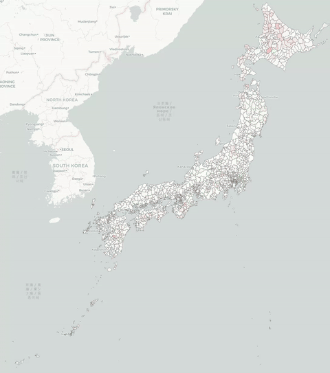

# Hollow Japan 日本空洞化

An interactive visualization of Japanese municipal population change from 1980 to 2050, with both a 2D Leaflet map and a 3D Three.js isometric map.

Data is available for every year (1-year intervals), with census years (1980–2020 every 5 years) and projected years (2025–2050 every 5 years) drawn from official sources, and intermediate years computed by linear interpolation.

Live demo: [https://jpatokal.github.io/hollow-japan/](https://jpatokal.github.io/hollow-japan/)

## Features




- **Dual views**: 2D Leaflet map (`index.html`) and 3D Three.js isometric map (`3d.html`)
- **Year slider** with play/pause animation across 70 years (1980–2050)
- **Two colour modes**:
  - **Last 5 years** — shows % change from the previous 5-year mark (scale: −10% to +10%)
  - **Since 1980** — shows cumulative % change since 1980 (scale: −90% to +90%, with deep red fading to black for extreme decline)
- **Language toggle**: switch between English and Japanese labels
- **Hover info**: click or hover any municipality to see population, 5-year change, and change since 1980
- **Responsive design**: works on mobile with compact controls

## Installation

The code is pure Javascript and can be run locally with any HTTP server.
Clone with `--recurse-submodules` to download the necessary `simplify-japan-geojson` submodule.

```bash
git clone --recurse-submodules https://github.com/jpatokal/hollow-japan.git
cd hollow-japan
python3 -m http.server 8080
```

Then open:
- **2D map**: http://localhost:8080/
- **3D map**: http://localhost:8080/3d.html

Pass in any municipality code to highlight a specific area, e.g. `http://localhost:8080/?code=1209` to highlight Yubari, Hokkaido.

## Data sources

Data is sourced from publicly available Japanese government statistics. All non-census and non-projected years (1981–1984, 1986–1989, etc.) are computed by simple linear interpolation between the nearest available data points.

### Census data (1980–2020)

Per-municipality population data for census years 1980, 1985, 1990, 1995, 2000, 2005, 2010, 2015, 2020 from [e-Stat](https://www.e-stat.go.jp), search for 国勢調査 人口等基本集計 第1-1. At time of writing, full results for the 2025 census have not yet been published.

Historical municipality boundaries have changed over time due to mergers and splits. 
[Keisuke Kondo's data and tooling](https://keisukekondokk.github.io/data/index.html#municipalcode) was used to reconcile boundaries from 1980 to 2020.

### Future projections (2025–2050)

Population projections for future years (2025–2050) are sourced from the [National Institute of Population and Social Security Research](https://www.ipss.go.jp), specifically Table 2 (都道府県・市区町村別の総人口) of the [2023 projection by region](https://www.ipss.go.jp/pp-shicyoson/j/shicyoson23/t-page.asp) (日本の地域別将来推計人口 令和５(2023)年推計), which assumes "medium fertility and medium mortality".

Projections are not available for municipalities impacted by the Fukushima disaster's exclusion zone, which consequently shows up as a white patch beyond 2020.

### Geometry

Simplified GeoJSON shapes for Japanese municipalities are sourced as a submodule from [simplify-japan-geojson](https://github.com/ricewin/simplify-japan-geojson), which in turn is based on [open administrative boundary data](https://nlftp.mlit.go.jp/ksj/gml/datalist/KsjTmplt-N03-2026.html) (行政区域データ) from the Ministry of Land, Infrastructure, Transport and Tourism (MLIT).

## License

Code licensed under the [GNU Affero General Public License v3.0](LICENSE).

Statistical data from e-Stat and IPSS is published under the [Public Data License (PDL) 1.0](https://www.digital.go.jp/en/resources/open_data/public_data_license_v1.0), which is compatible with the Creative Commons Attribution (CC BY 4.0) license. MLIT geodata is published directly under [CC BY 4.0](https://nlftp.mlit.go.jp/ksj/other/agreement_01.html). All data processing, modifications, and subsequent projections displayed here were generated independently and are not officially endorsed by the Government of Japan.
